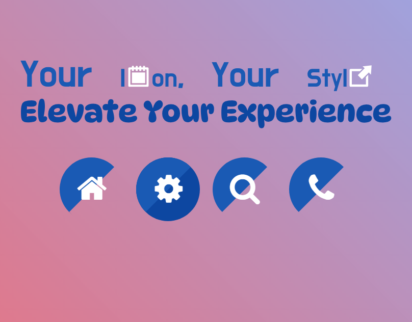

## Your Icon, Your Style |  Elevate Your Experience

<a href="https://www.linkedin.com/in/dharmendraverma95/" target="_blank">LinkedIn Profile </a>

<a href="https://www.behance.net/dhirukumar" target="_blank">Behance Profile </a>

## Project Overview
Welcome to Your Icon, Your Style! This project helps you easily create, customize, and implement beautiful icons for your web and mobile interfaces. Whether you’re building a new UI or enhancing an existing one, we provide simple solutions to make your icons pop and enhance user experience.

## Features
- Customizable Icons: Choose from a variety of icons and personalize them with different styles and colors.

- Popup Designs: Easily integrate popups with sleek animations and modern designs.

- Responsive Design: Works seamlessly across different devices and screen sizes.

- Lightweight: Fast and minimal code for improved performance.

- Easy to Implement: Plug-and-play code snippets for quick integration.

  

###### Lang
<ul>
  <li>HTML5</li>
  <li>SCSS</li>
  <li>ChatGPT [For Content]</li>
  <li>Desgin in Abode XD</li>
</ul>

 
Desktop Design 

 
Desktop UI UX Design 

 
Desktop Design UI UX Layout 

 
Desktop Design 

Cover 
